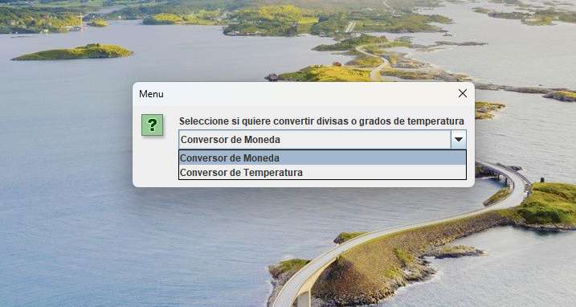

# Conversor de medidas de temperatura y monedas extrangeras a Pesos Argentinos y viceversa.

**Conversor de temperatura y moneda** es una aplicación JavaFX  que permite convertir diferentes monedas a pesos argentinos y viceversa. También permite pasar grados de temperatura entre diferentes tipos de medidas.

## Características

- Convertir Pesos Argentinos a diferentes monedas extrangeras como: Dólares, Euros, Libras, Yuanes y Wones Coreanos.
- Convierte grados de temperatura de grados celcius a: Grados Farenheit y Kelvin.
- Usa una interface con un input y un display.

## Captura de pantalla.

### Requisitos

- Java Development Kit (JDK) 8 or later.

### Instalación

1. Clonar la aplicción a su maquina personal:
2. Abrir el proyecto en el Java Integrated Development Environment (IDE).
3. Correr la aplicación.

## Modo de uso

1. Lanzar la aplicación.
2. Ejegir si quiere convertir Monedas o Grados de Temperatura.
3. Elegir el monto o los grados a convertir.
4. Elegir a que divisa o medida de temperatura quiere convertir.
5. Cerrar la aplicación cuando termine.

## Autor
- Nicolás Nazarre.